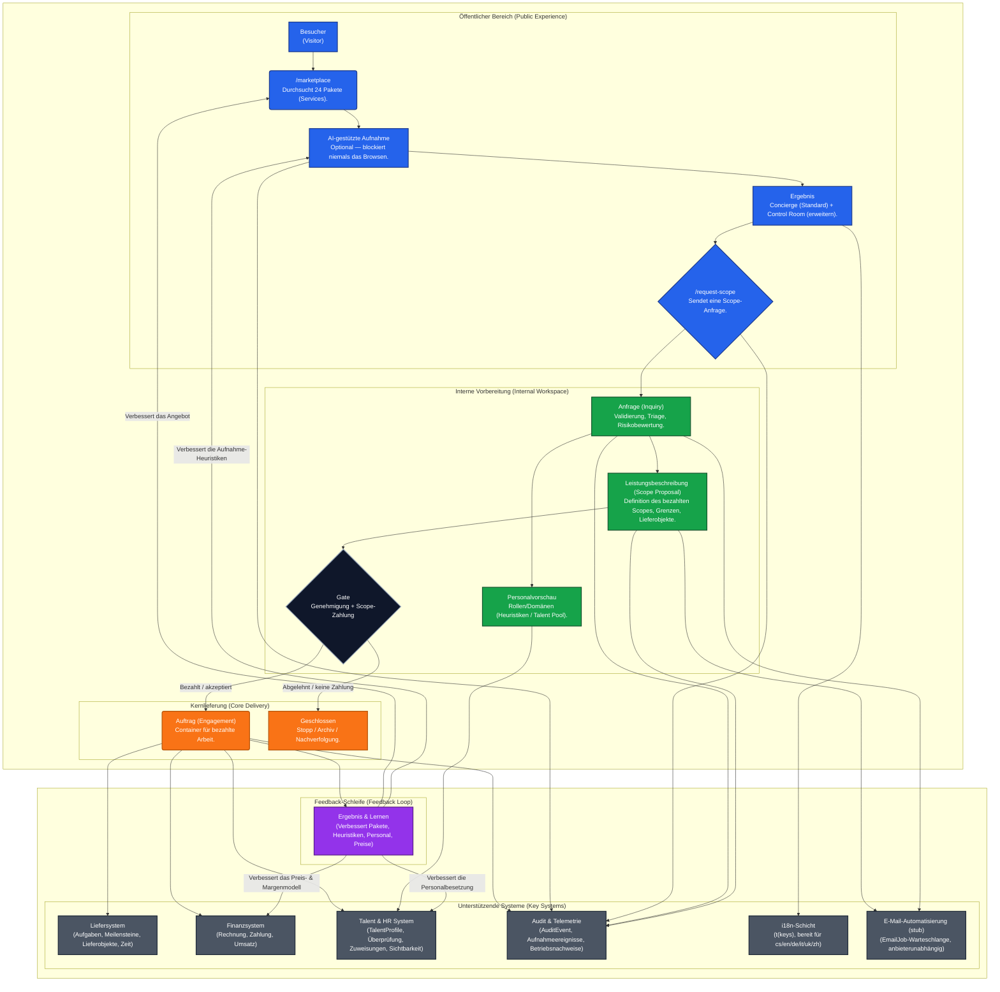

# Visual System Map (DE)

Dieses Dokument bietet eine visuelle Karte des Lucien2026-Systems, die sich auf den Hauptwertstrom und die unterstützenden Schlüsselsysteme konzentriert.

```mermaid
flowchart TD
    %% ============================================================
    %% L0: SINGLE VALUE FLOW (one system, four views)
    %% ============================================================

    subgraph Z0[" "]
        direction TB

        %% ---------------------------
        %% PUBLIC EXPERIENCE
        %% ---------------------------
        subgraph Z1["Öffentlicher Bereich (Public Experience)"]
            direction LR
            A["Besucher<br>(Visitor)"] --> B("/marketplace<br>Durchsucht 24 Pakete (Services).")
            B --> B1["AI-gestützte Aufnahme<br>Optional — blockiert niemals das Browsen."]
            B1 --> B2["Ergebnis<br>Concierge (Standard) + Control Room (erweitern)."]
            B2 --> C{"/request-scope<br>Sendet eine Scope-Anfrage."}
        end

        %% ---------------------------
        %% INTERNAL WORKSPACE
        %% ---------------------------
        subgraph Z2["Interne Vorbereitung (Internal Workspace)"]
            direction LR
            C --> D["Anfrage (Inquiry)<br>Validierung, Triage, Risikobewertung."]
            D --> D1["Personalvorschau<br>Rollen/Domänen (Heuristiken / Talent Pool)."]
            D --> E["Leistungsbeschreibung (Scope Proposal)<br>Definition des bezahlten Scopes, Grenzen, Lieferobjekte."]
            E --> GATE{"Gate<br>Genehmigung + Scope-Zahlung"}
        end

        %% ---------------------------
        %% CORE DELIVERY
        %% ---------------------------
        subgraph Z3["Kernlieferung (Core Delivery)"]
            direction LR
            GATE -- "Bezahlt / akzeptiert" --> F("Auftrag (Engagement)<br>Container für bezahlte Arbeit.")
            GATE -- "Abgelehnt / keine Zahlung" --> X["Geschlossen<br>Stopp / Archiv / Nachverfolgung."]
        end
    end

    %% ============================================================
    %% KEY SYSTEMS (supporting capabilities)
    %% ============================================================
    subgraph Z4[" "]
        direction LR

        subgraph Z5["Unterstützende Systeme (Key Systems)"]
            direction TB

            SYS1["Liefersystem<br>(Aufgaben, Meilensteine, Lieferobjekte, Zeit)"]
            SYS2["Finanzsystem<br>(Rechnung, Zahlung, Umsatz)"]
            SYS3["Talent & HR System<br>(TalentProfile, Überprüfung, Zuweisungen, Sichtbarkeit)"]
            SYS4["Audit & Telemetrie<br>(AuditEvent, Aufnahmeereignisse, Betriebsnachweise)"]
            SYS5["i18n-Schicht<br>(t(keys), bereit für cs/en/de/it/uk/zh)"]
            SYS6["E-Mail-Automatisierung (stub)<br>(EmailJob-Warteschlange, anbieterunabhängig)"]
        end

        subgraph Z6["Feedback-Schleife (Feedback Loop)"]
           J["Ergebnis & Lernen<br>(Verbessert Pakete, Heuristiken, Personal, Preise)"]
        end
    end

    %% ============================================================
    %% CONNECTIONS: Engagement uses systems
    %% ============================================================
    F --> SYS1
    F --> SYS2
    F --> SYS3
    F --> SYS4

    %% ============================================================
    %% CONNECTIONS: Earlier stages also use systems
    %% ============================================================
    B1 --> SYS4
    B2 --> SYS5
    C --> SYS4
    D --> SYS4
    E --> SYS4

    D1 --> SYS3
    E --> SYS6
    D --> SYS6

    %% ============================================================
    %% FEEDBACK LOOP
    %% ============================================================
    F --> J
    J -- "Verbessert das Angebot" --> B
    J -- "Verbessert die Aufnahme-Heuristiken" --> B1
    J -- "Verbessert die Personalbesetzung" --> SYS3
    J -- "Verbessert das Preis- & Margenmodell" --> SYS2

    %% ============================================================
    %% STYLING
    %% ============================================================
    classDef public fill:#2563eb,color:#fff,stroke:#1e3a8a,stroke-width:2px
    classDef internal fill:#16a34a,color:#fff,stroke:#14532d,stroke-width:2px
    classDef delivery fill:#f97316,color:#fff,stroke:#b45309,stroke-width:2px
    classDef systems fill:#4b5563,color:#fff,stroke:#1f2937,stroke-width:2px
    classDef feedback fill:#9333ea,color:#fff,stroke:#581c87,stroke-width:2px
    classDef gate fill:#0f172a,color:#fff,stroke:#94a3b8,stroke-width:2px

    class A,B,B1,B2,C public
    class D,D1,E internal
    class F,X delivery
    class SYS1,SYS2,SYS3,SYS4,SYS5,SYS6 systems
    class J feedback
    class GATE gate
```
