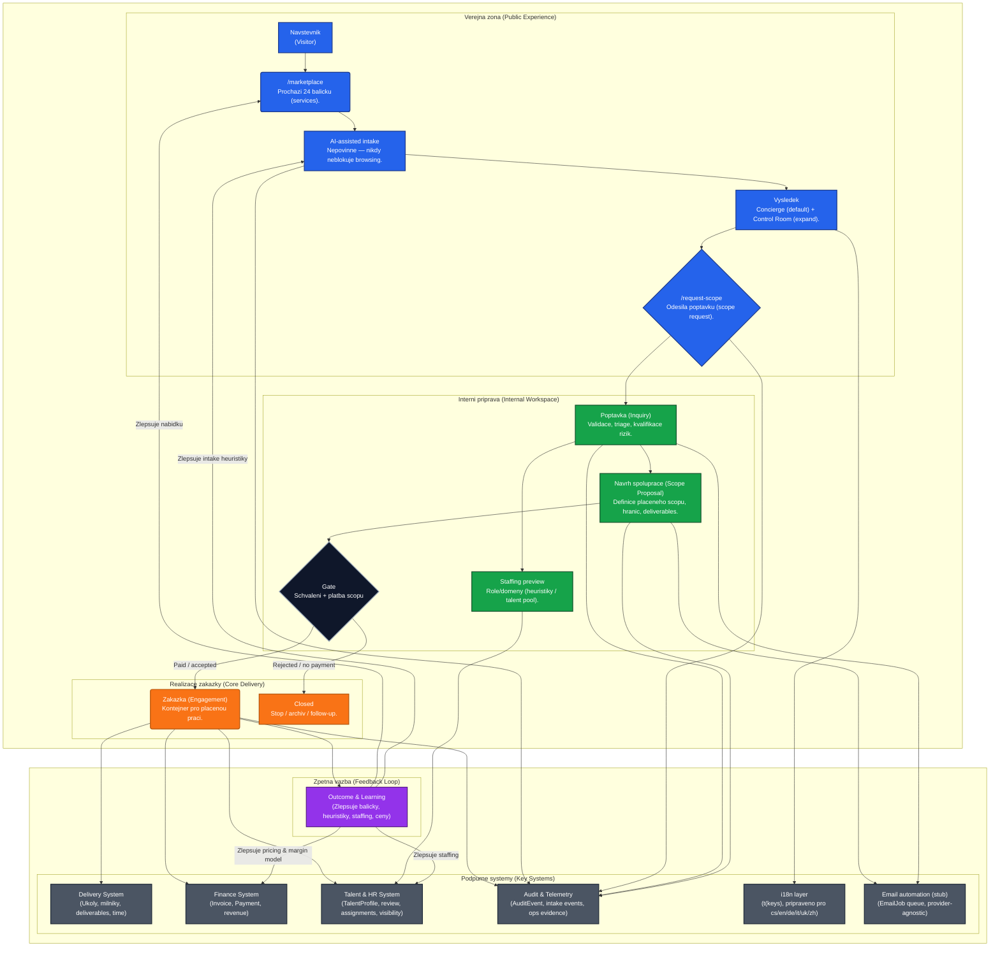

# Visual System Map

This document provides a visual map of the Lucien2026 system, focusing on the main value flow and the key systems that support it.

```mermaid
flowchart TD
    %% ============================================================
    %% L0: SINGLE VALUE FLOW (one system, four views)
    %% ============================================================

    subgraph Z0[" "]
        direction TB

        %% ---------------------------
        %% PUBLIC EXPERIENCE
        %% ---------------------------
        subgraph Z1["Verejna zona (Public Experience)"]
            direction LR
            A["Navstevnik<br>(Visitor)"] --> B("/marketplace<br>Prochazi 24 balicku (services).")
            B --> B1["AI-assisted intake<br>Nepovinne — nikdy neblokuje browsing."]
            B1 --> B2["Vysledek<br>Concierge (default) + Control Room (expand)."]
            B2 --> C{"/request-scope<br>Odesila poptavku (scope request)."}
        end

        %% ---------------------------
        %% INTERNAL WORKSPACE
        %% ---------------------------
        subgraph Z2["Interni priprava (Internal Workspace)"]
            direction LR
            C --> D["Poptavka (Inquiry)<br>Validace, triage, kvalifikace rizik."]
            D --> D1["Staffing preview<br>Role/domeny (heuristiky / talent pool)."]
            D --> E["Navrh spoluprace (Scope Proposal)<br>Definice placeneho scopu, hranic, deliverables."]
            E --> GATE{"Gate<br>Schvaleni + platba scopu"}
        end

        %% ---------------------------
        %% CORE DELIVERY
        %% ---------------------------
        subgraph Z3["Realizace zakazky (Core Delivery)"]
            direction LR
            GATE -- "Paid / accepted" --> F("Zakazka (Engagement)<br>Kontejner pro placenou praci.")
            GATE -- "Rejected / no payment" --> X["Closed<br>Stop / archiv / follow-up."]
        end
    end

    %% ============================================================
    %% KEY SYSTEMS (supporting capabilities)
    %% ============================================================
    subgraph Z4[" "]
        direction LR

        subgraph Z5["Podpurne systemy (Key Systems)"]
            direction TB

            SYS1["Delivery System<br>(Ukoly, milniky, deliverables, time)"]
            SYS2["Finance System<br>(Invoice, Payment, revenue)"]
            SYS3["Talent & HR System<br>(TalentProfile, review, assignments, visibility)"]
            SYS4["Audit & Telemetry<br>(AuditEvent, intake events, ops evidence)"]
            SYS5["i18n layer<br>(t(keys), pripraveno pro cs/en/de/it/uk/zh)"]
            SYS6["Email automation (stub)<br>(EmailJob queue, provider-agnostic)"]
        end

        subgraph Z6["Zpetna vazba (Feedback Loop)"]
           J["Outcome & Learning<br>(Zlepsuje balicky, heuristiky, staffing, ceny)"]
        end
    end

    %% ============================================================
    %% CONNECTIONS: Engagement uses systems
    %% ============================================================
    F --> SYS1
    F --> SYS2
    F --> SYS3
    F --> SYS4

    %% ============================================================
    %% CONNECTIONS: Earlier stages also use systems
    %% ============================================================
    B1 --> SYS4
    B2 --> SYS5
    C --> SYS4
    D --> SYS4
    E --> SYS4

    D1 --> SYS3
    E --> SYS6
    D --> SYS6

    %% ============================================================
    %% FEEDBACK LOOP
    %% ============================================================
    F --> J
    J -- "Zlepsuje nabidku" --> B
    J -- "Zlepsuje intake heuristiky" --> B1
    J -- "Zlepsuje staffing" --> SYS3
    J -- "Zlepsuje pricing & margin model" --> SYS2

    %% ============================================================
    %% STYLING
    %% ============================================================
    classDef public fill:#2563eb,color:#fff,stroke:#1e3a8a,stroke-width:2px
    classDef internal fill:#16a34a,color:#fff,stroke:#14532d,stroke-width:2px
    classDef delivery fill:#f97316,color:#fff,stroke:#b45309,stroke-width:2px
    classDef systems fill:#4b5563,color:#fff,stroke:#1f2937,stroke-width:2px
    classDef feedback fill:#9333ea,color:#fff,stroke:#581c87,stroke-width:2px
    classDef gate fill:#0f172a,color:#fff,stroke:#94a3b8,stroke-width:2px

    class A,B,B1,B2,C public
    class D,D1,E internal
    class F,X delivery
    class SYS1,SYS2,SYS3,SYS4,SYS5,SYS6 systems
    class J feedback
    class GATE gate
```